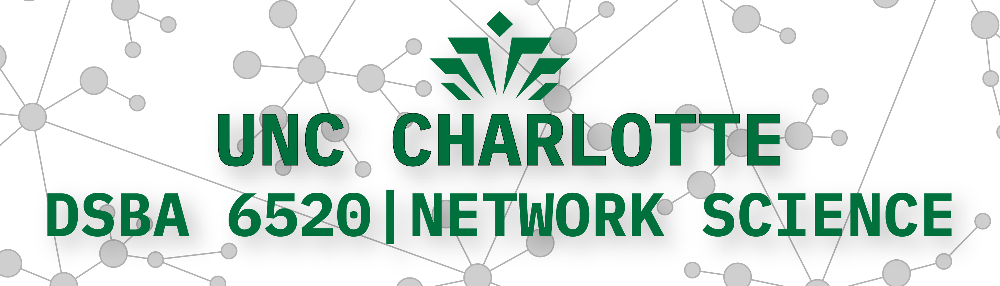

# 

This repository contains the code for generating the course website for UNCC DSBA-6520.

## Attribution

This framework was originally forked from Praneel Nihar's [streamlit-multiapps](https://github.com/upraneelnihar/streamlit-multiapps).

Much thanks goes Ryan Wesslen for his [Visual Analytics course website](https://github.com/wesslen) which serves as the basis for this app.
    
## License

 This work is licensed under a <a rel="license" href="http://creativecommons.org/licenses/by-nc-sa/4.0/">Creative Commons Attribution-NonCommercial-ShareAlike 4.0 International License</a>

